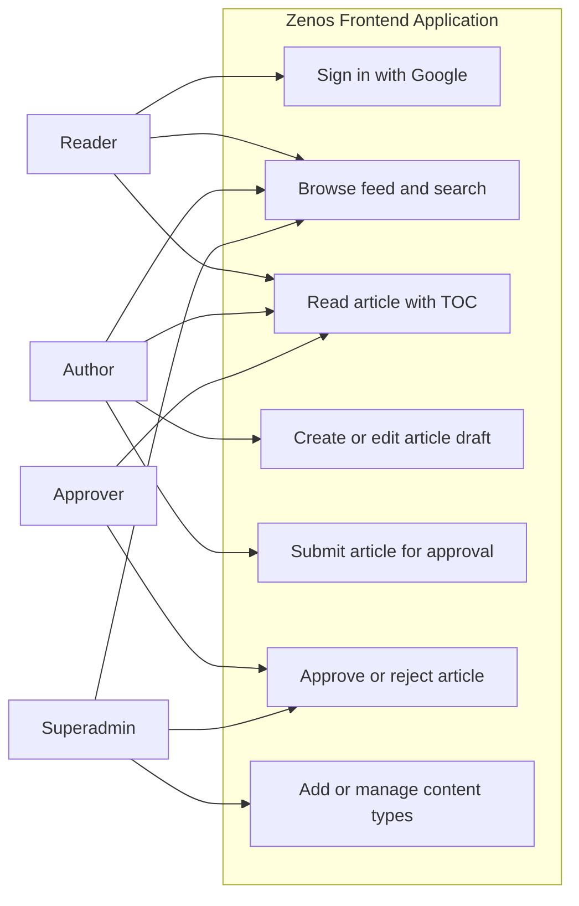
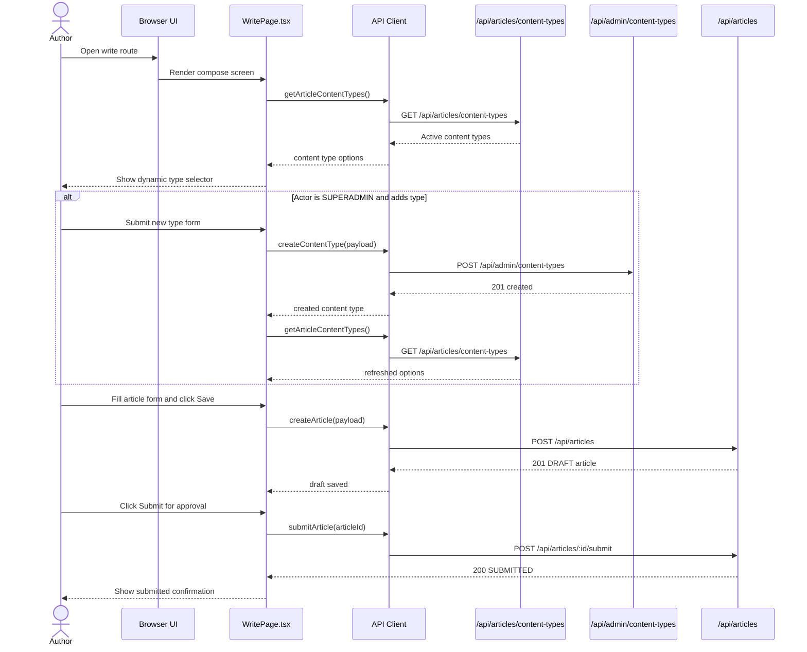
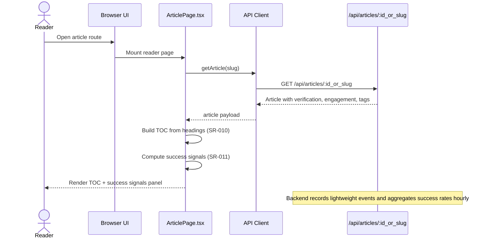

# zenos.work Frontend — Use Cases and Flows

This document captures frontend-facing use cases and UI flow coverage for MVP1, MVP2, and MVP3.

## MVP Scope Coverage

### MVP1: Publishable Knowledge Platform

- Google authentication entry and session bootstrap
- Reader home feed and article reader experience
- Author draft creation, editing, and submission
- Dynamic content-type selection in writing and search filters
- SR-010: in-article table of contents generated from heading structure
- SR-011: article success signals panel showing:
  - Verification freshness signal
  - Engagement traction signal (views, likes, comments)
  - Outcome evidence signal from outcome tags
    - Backed by SR-011 analytics pipeline (event capture + hourly backend aggregation)

### MVP2: Trust, Compliance, and Moderation

- Approval queue and moderation controls for privileged roles
- Rejection feedback visibility and resubmission flow
- Policy-aware role gating in UI routes and actions
- Metadata-aware publishing screens (verification and content validity)

### MVP3: Discovery and Growth Loops

- Personalised discovery and search refinement
- Social engagement surfaces (likes, bookmarks, follows)
- Notification-driven return loops
- Admin analytics visibility and content governance controls

## Frontend Use-Case Diagram

## Frontend Sequence Diagram

## Frontend Sequence Diagram (Reader Success Signals)

